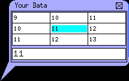

# infopop

Implementing a popup bubble with an embedded MiniTable in Qt

Infopop is popup bubble a la Google Maps with an embedded MiniTable. It is useful for annotating pretty much anything in a GUI.

When in-focus the user may scroll in the MiniTable. Size and location (at the pointer's tip) is given on creation. The pointer maybe positioned on the right side. When not in-focus, the window is 66% transparent (assuming your OS is capable). Finally, it has methods that may be SLOTted to if you which to have it track a particular point in your GUI as it moves.

[code](infopop.tar.bz2)