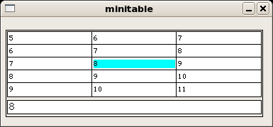

# minitable

Implementing a very compact but usable data table in Qt

MiniTable is a custom QWidget implementing a table. Given a QRect to draw in and a specified number of columns, it will draw the appropriate number of table rows along with a data viewing area.

The goal of MiniTable is to be able to display data in a small area. It does this by using a very small font for table cells but renders the current cell in a larger font and in a wider area below the table. When in-focus the user is able to scroll through the table data.

Currently, data in the table cells is uneditable.

[code](code.zip)
